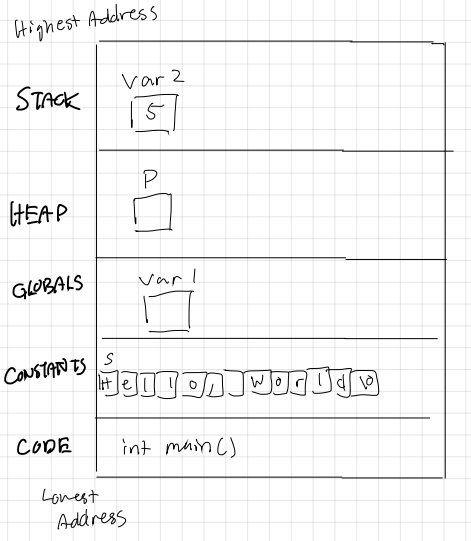

# Exercise 1 Answers

### The address space

3. 

4. The heap of the system grows up to higher addresses.

5. The stack grows down to lower addresses.

6. I chose to allocate two blocks of 20 bytes of memory. There is 32 bits or 4 bytes.

### Stack allocated data

1. The program contains 2 functions in addition to the main function. It first creates a pointer to the first element of an integer array defined in foo. Then it calls bar which creates its own local integer array. The main loop then iteratively prints out all elements in the array passed by foo.

The output would be the address of the array in foo, the address of the array in bar, and 5 prints of "42" each on its own line.

2. Yes. THe warning warns against returning addresses of local variables and in this case the local array created in foo.

3. I get a segmentation fault. This is happening because by returning the address of an array declared in the foo function and keeping this address in the pointer array in the main function, even when the foo function completes and gets popped off the stack, the memory allocated to the first element of the array persists in the integer pointer array. So when bar is called as a new function and takes up memory in the space foo previously existed in, memory is overwritten. Then trying to access this memory through the pointer array causes a segmentation fault.

4. There is no segmentation fault error.

